# Aomi SDK

[](./LICENSE)
[](https://www.rust-lang.org/)
[](https://github.com/aomi-labs/aomi-sdk/actions/workflows/ci.yml)

> Build plugins for Aomi — open-source AI infrastructure for automating crypto.

## What is Aomi SDK?

The Aomi SDK is the open-source plugin development kit for extending Aomi — open-source AI infrastructure for automating crypto. This repository contains the public SDK, reference apps, and a build toolchain for compiling dynamic plugins that the Aomi runtime hot-loads.

This repository contains public dynamic app crates, the public SDK they build against, and a small build toolchain for compiling plugins. It intentionally excludes:

- the runtime / loader implementation
- admin and database-facing apps
- oversized internal apps like `l2beat`
- proprietary infrastructure, internal namespaces, and private deployment wiring

## What Lives Here

- `apps/*`: public app crates that compile to dynamic plugins
- `sdk`: the public plugin SDK used by those apps
- `xtask`: helper commands for building and validating plugins in this repo
- `sdk/examples/app-template-http`: reference app showing the recommended file layout for a new plugin
- `docs/host-interop.md`: the public host capability contract used by execution-oriented apps
- `docs/repo-structure.md`: how to structure a new app crate in this repo

## Included Apps

- `defi`
- `delta`
- `kalshi`
- `khalani`
- `molinar`
- `para`
- `para-consumer`
- `pelagos`
- `polymarket`
- `prediction`
- `social`
- `x`

## What Can I Build?

The Aomi SDK lets you wrap any crypto API as a dynamic plugin that the Aomi runtime hot-loads. The apps in this repo show the range:

- **DeFi** — wrap a DEX, lending, or staking protocol as chat-driven tools (see `defi`)
- **Prediction markets** — market discovery, search, and trading flows (see `polymarket`, `kalshi`)
- **Cross-chain intents** — bridge and intent-order clients (see `khalani`)
- **Social / media** — feeds, posts, user data (see `social`, `x`)
- **Wallet and account tooling** — manage keys, wallets, and account flows (see `para`)
- **Games / metaverse** — in-game actions, inventory, chat (see `molinar`)

## Public Boundary

Apps in this repository may depend on:

- `sdk`
- public HTTP APIs
- environment variables for third-party API keys
- documented host interoperability conventions

Apps in this repository must not depend on:

- internal databases
- private control planes
- internal-only namespaces like `database`
- hidden fallback infrastructure

## Quick Start

1. Copy `sdk/examples/app-template-http` or an existing `apps/*` crate.
2. Keep the standard file split:
   - `src/lib.rs`: app manifest + preamble
   - `src/client.rs`: HTTP client + models
   - `src/tool.rs`: tool implementations
3. If your app needs wallet execution or signing, use the public host conventions from `docs/host-interop.md`.

## Build Plugins

Build every app plugin into `plugins/` with:

```bash
cargo run -p xtask -- build-aomi
```

Useful flags:

```bash
cargo run -p xtask -- build-aomi --app x
cargo run -p xtask -- build-aomi --release
cargo run -p xtask -- build-aomi --target aarch64-apple-darwin
```

## Publication Pipeline

Apps are developed via PR, built by CI, and delivered to the runtime as pre-built dynamic plugins.

### Workflow

1. Developer creates/modifies an app and opens a PR to `main`
2. CI runs tests, clippy, and builds all plugins to validate
3. PR is merged to `main`, then merged forward to `publish`
4. Push to `publish` triggers the release workflow which auto-tags, cross-compiles, and publishes a GitHub Release
5. The product-mono backend polls for new releases, downloads the tarball, and hot-reloads changed plugins

### Architecture

```mermaid
graph LR
    subgraph "aomi-apps repo"
        DEV[Developer]
        PR[PR to main]
        CI_CHECK[CI: test + build]
        PUBLISH[publish branch]
        RESOLVE[Resolve version<br/>+ auto-tag]
        BUILD_L[Build plugins<br/>linux x86_64]
        BUILD_M[Build plugins<br/>macOS ARM64]
        TARBALL_L[tarball + manifest<br/>linux]
        TARBALL_M[tarball + manifest<br/>macOS]
        RELEASE[GitHub Release<br/>apps-v0.x.y]
    end

    subgraph "product-mono backend"
        FETCHER[PluginFetcher<br/>polls every 5min]
        EXTRACT[Download + extract<br/>+ verify SHA256]
        LOADER[AppLoader<br/>dlopen + SDK version check]
        REGISTRY["DashMap<br/>(AppKey → Arc&lt;App&gt;)"]
        SESSIONS[Active sessions<br/>keep old Arc]
        NEW[New sessions<br/>get new Arc]
    end

    DEV --> PR --> CI_CHECK --> PUBLISH
    PUBLISH --> RESOLVE
    RESOLVE --> BUILD_L & BUILD_M
    BUILD_L --> TARBALL_L --> RELEASE
    BUILD_M --> TARBALL_M --> RELEASE
    RELEASE -.->|HTTP poll| FETCHER
    FETCHER --> EXTRACT --> LOADER --> REGISTRY
    REGISTRY --> SESSIONS
    REGISTRY --> NEW
```



### Release Sequence


### Tarball Format

Each GitHub Release contains per-target tarballs:

```
aomi-plugins-v0.1.0-x86_64-unknown-linux-gnu.tar.gz
└── plugins/
    ├── manifest.json
    ├── defi.so
    ├── delta.so
    ├── kalshi.so
    ├── khalani.so
    ├── molinar.so
    ├── para.so
    ├── para_consumer.so
    ├── pelagos.so
    ├── polymarket.so
    ├── prediction.so
    ├── social.so
    └── x.so
```

`manifest.json` contains the app release version, app release tag, SDK version, target triple, commit SHA, and per-plugin SHA256 checksums.

### Environment Variables (Backend)

| Variable | Default | Description |
|---|---|---|
| `APP_RELEASE_TAG` | `latest` | Release tag to fetch (`apps-v0.1.14` or `latest`) |
| `AOMI_PLUGINS_REPO` | `aomi-labs/aomi-sdk` | GitHub `owner/repo` for releases |
| `AOMI_PLUGINS_POLL_SECS` | `300` | Poll interval in seconds |
| `GITHUB_TOKEN` | — | Optional auth for private repos |

### Local Development

```bash
# Build all plugins locally
cargo xtask build-aomi

# Build a single app
cargo xtask build-aomi --app defi

# Scaffold a new app
cargo xtask new-app my-app

# Test against product-mono (from product-mono root)
LOCAL_AOMI_APPS=/path/to/aomi-apps bash scripts/dev.sh --local-apps
```

## SDK and Examples

The SDK is vendored in `sdk`, including its tests and `examples/hello-app`, so this repository compiles without reaching back into `product-mono`.

## FAQ

**Is the Aomi SDK open-source?**
Yes. The plugin SDK, example apps, and build toolchain in this repo are all MIT licensed. The runtime/loader implementation is intentionally excluded and not open-source.

**What language is the SDK in?**
Rust. Plugins compile to dynamic libraries (`.so` on Linux, `.dylib` on macOS) that the runtime hot-loads.

**How do I scaffold a new app?**
Run `cargo run -p xtask -- new-app <name>`, or copy `sdk/examples/app-template-http` and adapt it. The standard file split is `lib.rs` (manifest + preamble), `client.rs` (HTTP client + models), `tool.rs` (tool implementations).

**How does hot-loading work?**
This repo publishes GitHub Releases with pre-built plugin tarballs per target (Linux x86_64, macOS ARM64). The backend polls for new releases every 5 minutes, downloads and verifies the tarball, then atomically swaps new plugin binaries in via `dlopen`. Active sessions keep their old plugin `Arc`; new sessions get the new one. No restart required.

**Do I need to deploy infrastructure to get my plugin running?**
No. Once your PR merges to `publish`, CI builds and publishes the plugin tarball. The Aomi runtime picks it up on the next poll.

**Can I test a plugin locally before opening a PR?**
Yes. Build with `cargo run -p xtask -- build-aomi --app <name>`, run unit tests using the `aomi_sdk::testing` helpers (`TestCtxBuilder`, `run_tool`, `run_async_tool`), and point a local product-mono instance at your working copy with `LOCAL_AOMI_APPS=/path/to/aomi-apps`.

**How do I structure tool descriptions so the LLM uses them correctly?**
Prefer intent-shaped names (`search_*`, `get_*`, `build_*`, `submit_*`) over raw endpoint wraps. Keep the toolset small — 3 to 8 tools per app is typical for a clean workflow. Use `JsonSchema` with doc comments for typed arguments; those comments are model-facing and directly shape how the agent picks tools. See `sdk/examples/app-template-http` for the canonical pattern.
