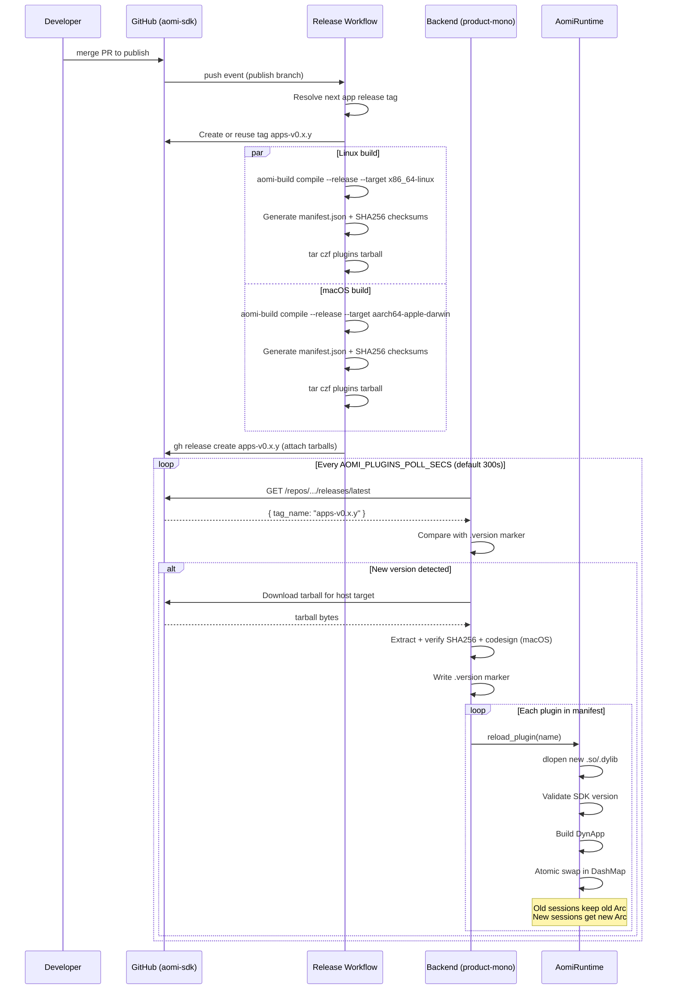

# Aomi SDK

[](./LICENSE)
[](https://www.rust-lang.org/)
[](https://github.com/aomi-labs/aomi-sdk/actions/workflows/ci.yml)

> Build plugins for Aomi — open-source AI infrastructure for automating crypto.

## What is Aomi SDK?

The Aomi SDK is the open-source plugin development kit for extending Aomi — open-source AI infrastructure for automating crypto. This repository contains the public SDK, reference apps, and a build toolchain for compiling dynamic plugins that the Aomi runtime hot-loads.

This repository contains public dynamic app crates, the public SDK they build against, and a small build toolchain for compiling plugins. It intentionally excludes:

- the runtime / loader implementation
- admin and database-facing apps
- oversized internal apps like `l2beat`
- proprietary infrastructure, internal namespaces, and private deployment wiring

## What Lives Here

- `apps/*`: official app crates that compile to dynamic plugins
- `sdk`: the public plugin SDK used by those apps
- `sdk/bin/build`: the **`aomi-build`** CLI — scaffold apps from OpenAPI specs, compile and validate plugins, and deploy/activate hosted apps. See [`docs/aomi-build.md`](./docs/aomi-build.md)
- `sdk/examples/app-template-http`: reference app showing the recommended file layout for a new plugin
- `docs/host-interop.md`: the public host capability contract used by execution-oriented apps
- `docs/repo-structure.md`: how to structure a new app crate in this repo

## Where do new apps go?

Three distinct paths depending on who you are. Pick the right one before
you start authoring.

| If you're… | Publish to | Read first |
|---|---|---|
| A **community contributor** building a public app | [`aomi-labs/community-apps`](https://github.com/aomi-labs/community-apps) | [`docs/community-deployment.md`](./docs/community-deployment.md) |
| A **Krexa platform partner** | [`aomi-labs/krexa-hosted-apps`](https://github.com/aomi-labs/krexa-hosted-apps) (invite-only) | [krexa-hosted-apps/CONTRIBUTING.md](https://github.com/aomi-labs/krexa-hosted-apps/blob/publish/CONTRIBUTING.md) |
| **Maintaining an official Aomi app** | this repo's `apps/` | [`docs/repo-structure.md`](./docs/repo-structure.md) + "Publication Pipeline" below |

The first two paths use **`aomi-build deploy`** from your source repo. The CLI
checks the local SDK pin, syncs the connected GitHub App source, sends the
commit SHA and `aomi.toml` paths to the platform backend, waits for the platform
release, activates it, and verifies the app is active, artifact-ready, and
loaded. You do not open a PR against this SDK repo for hosted community or
partner apps.

The third path is for Aomi-team-maintained official apps that ship from this
repo as part of the `apps-v0.x.y` SDK releases.

If you're new and unsure which is yours: it's probably the **community
contributor** row.

## Official Apps

- `defi`
- `delta`
- `kalshi`
- `khalani`
- `molinar`
- `para`
- `para-consumer`
- `pelagos`
- `polymarket`
- `prediction`
- `social`
- `x`
- `cambrian`
- `vaultsfyi`
- `morpho-vaults`

## What Can I Build?

The Aomi SDK lets you wrap any crypto API as a dynamic plugin that the Aomi runtime hot-loads. The apps in this repo show the range:

- **DeFi** — wrap a DEX, lending, or staking protocol as chat-driven tools (see `defi`)
- **Prediction markets** — market discovery, search, and trading flows (see `polymarket`, `kalshi`)
- **Cross-chain intents** — bridge and intent-order clients (see `khalani`)
- **Social / media** — feeds, posts, user data (see `social`, `x`)
- **Wallet and account tooling** — manage keys, wallets, and account flows (see `para`)
- **Games / metaverse** — in-game actions, inventory, chat (see `molinar`)

## Public Boundary

Apps in this repository may depend on:

- `sdk`
- public HTTP APIs
- environment variables for third-party API keys
- documented host interoperability conventions

Apps in this repository must not depend on:

- internal databases
- private control planes
- internal-only namespaces like `database`
- hidden fallback infrastructure

## Quick Start

1. Copy `sdk/examples/app-template-http` or an existing `apps/*` crate.
2. Keep the standard file split:
   - `src/lib.rs`: app manifest + preamble
   - `src/client.rs`: HTTP client + models
   - `src/tool.rs`: tool implementations
3. If your app needs wallet execution or signing, use the public host conventions from `docs/host-interop.md`.

## Build Plugins

First install the build CLI (one time):

```bash
cargo install aomi-sdk --features cli
```

Then build every app plugin into `plugins/` with:

```bash
aomi-build compile
```

Useful flags:

```bash
aomi-build compile --app x
aomi-build compile --release
aomi-build compile --target aarch64-apple-darwin
```

(Without installing, you can also run it ad-hoc:
`cargo run -p aomi-sdk --features cli --bin aomi-build -- compile`.)

## Deploy Hosted Apps

Community and partner source repos deploy through the same `aomi-build` binary:

```bash
aomi-build project create \
  --platform community \
  --repo owner/repo \
  --backend https://api.aomi.dev \
  --activation-token <platform-or-app-token>
git add .aomi/config.json && git commit && git push
aomi-build deploy
```

The binary alone is not enough: the source commit must be pushed to GitHub, the
Aomi GitHub App must be installed on the source repo, and the user needs a
platform/app activation token for the target platform. The user does **not**
need a GitHub PAT, platform repo write access, database access, or an admin
private key.

Backend and activation credentials may still come from flags, environment, or
saved login. Platform is selected once by `project create`, not by deploy.

The repository must commit one root `.aomi/config.json`; its singular
`platform` is checked against the Project and its `applications` array is the
complete set of `aomi.toml` manifests.

`deploy` writes `.aomi/deployment.json` in the source repo, waits for candidate
CI/release readiness, activates the recorded release tags, and fails unless the
final platform app endpoint reports `is_active=true`, `artifact_ready=true`, and
`loaded=true`. For manual recovery or CI scripting, the lifecycle is also
available as `aomi-build deploy preflight`, `aomi-build deploy run`,
`aomi-build deploy activate`, and `aomi-build deploy status`.

The CLI is only the relay. It does not push platform branches or hold a GitHub
token; the backend writes platform repo changes through the connected GitHub App
install. See the step-by-step
[`community deployment guide`](./docs/community-deployment.md) or the lower-level
[`aomi-build` reference](./docs/aomi-build.md#hosted-deployment).

## Publication Pipeline (official apps)

> This section describes how **official Aomi apps** (the ones in `apps/` of
> this repo) get to the runtime. Community apps and Krexa apps follow a
> different path via `aomi-build deploy` against their own platform repos —
> see "Where do new apps go?" above.

Official apps are developed via PR, built by CI, and delivered to the runtime as pre-built dynamic plugins.

### Workflow

1. Developer creates/modifies an app and opens a PR to `publish`
2. CI runs tests, clippy, and builds all plugins to validate
3. PR is merged to `publish`
4. Push to `publish` triggers the release workflow which auto-tags, cross-compiles, and publishes a GitHub Release
5. The product-mono backend polls for new releases, downloads the tarball, and hot-reloads changed plugins

### Architecture


```mermaid
graph LR
    subgraph "aomi-sdk repo"
        DEV[Developer]
        PR[PR to publish]
        CI_CHECK[CI: test + build]
        PUBLISH[publish branch]
        RESOLVE[Resolve version<br/>+ auto-tag]
        BUILD_L[Build plugins<br/>linux x86_64]
        BUILD_M[Build plugins<br/>macOS ARM64]
        TARBALL_L[tarball + manifest<br/>linux]
        TARBALL_M[tarball + manifest<br/>macOS]
        RELEASE[GitHub Release<br/>apps-v0.x.y]
    end

    subgraph "product-mono backend"
        FETCHER[PluginFetcher<br/>polls every 5min]
        EXTRACT[Download + extract<br/>+ verify SHA256]
        LOADER[AppLoader<br/>dlopen + SDK version check]
        REGISTRY["DashMap<br/>(AppKey → Arc&lt;App&gt;)"]
        SESSIONS[Active sessions<br/>keep old Arc]
        NEW[New sessions<br/>get new Arc]
    end

    DEV --> PR --> CI_CHECK --> PUBLISH
    PUBLISH --> RESOLVE
    RESOLVE --> BUILD_L & BUILD_M
    BUILD_L --> TARBALL_L --> RELEASE
    BUILD_M --> TARBALL_M --> RELEASE
    RELEASE -.->|HTTP poll| FETCHER
    FETCHER --> EXTRACT --> LOADER --> REGISTRY
    REGISTRY --> SESSIONS
    REGISTRY --> NEW
```

### Release Sequence


```mermaid
sequenceDiagram
    participant DEV as Developer
    participant GH as GitHub (aomi-sdk)
    participant CI as Release Workflow
    participant BE as Backend (product-mono)
    participant RT as AomiRuntime

    DEV->>GH: merge PR to publish
    GH->>CI: push event (publish branch)

    CI->>CI: Resolve next app release tag
    CI->>GH: Create or reuse tag apps-v0.x.y

    par Linux build
        CI->>CI: aomi-build compile --release --target x86_64-linux
        CI->>CI: Generate manifest.json + SHA256 checksums
        CI->>CI: tar czf plugins tarball
    and macOS build
        CI->>CI: aomi-build compile --release --target aarch64-apple-darwin
        CI->>CI: Generate manifest.json + SHA256 checksums
        CI->>CI: tar czf plugins tarball
    end

    CI->>GH: gh release create apps-v0.x.y (attach tarballs)

    loop Every AOMI_PLUGINS_POLL_SECS (default 300s)
        BE->>GH: GET /repos/.../releases/latest
        GH-->>BE: { tag_name: "apps-v0.x.y" }
        BE->>BE: Compare with .version marker

        alt New version detected
            BE->>GH: Download tarball for host target
            GH-->>BE: tarball bytes
            BE->>BE: Extract + verify SHA256 + codesign (macOS)
            BE->>BE: Write .version marker

            loop Each plugin in manifest
                BE->>RT: reload_plugin(name)
                RT->>RT: dlopen new .so/.dylib
                RT->>RT: Validate SDK version
                RT->>RT: Build DynApp
                RT->>RT: Atomic swap in DashMap
                Note over RT: Old sessions keep old Arc<br/>New sessions get new Arc
            end
        end
    end
```

### Tarball Format

Each GitHub Release contains per-target tarballs:

```
aomi-plugins-v0.1.0-x86_64-unknown-linux-gnu.tar.gz
└── plugins/
    ├── manifest.json
    ├── defi.so
    ├── delta.so
    ├── kalshi.so
    ├── khalani.so
    ├── molinar.so
    ├── para.so
    ├── para_consumer.so
    ├── pelagos.so
    ├── polymarket.so
    ├── prediction.so
    ├── social.so
    └── x.so
```

`manifest.json` contains the app release version, app release tag, SDK version, target triple, commit SHA, and per-plugin SHA256 checksums.

### Environment Variables (Backend)

| Variable | Default | Description |
|---|---|---|
| `APP_RELEASE_TAG` | `latest` | Release tag to fetch (`apps-v0.1.14` or `latest`) |
| `AOMI_PLUGINS_REPO` | `aomi-labs/aomi-sdk` | GitHub `owner/repo` for releases |
| `AOMI_PLUGINS_POLL_SECS` | `300` | Poll interval in seconds |
| `GITHUB_TOKEN` | — | Optional auth for private repos |

### Local Development

```bash
# Build all plugins locally
aomi-build compile

# Build a single app
aomi-build compile --app defi

# Scaffold a new app (bare skeleton; use `new-app` for OpenAPI-driven)
aomi-build init my-app

# Test against product-mono (from product-mono root)
LOCAL_AOMI_SDK=/path/to/aomi-sdk bash scripts/dev.sh --local-apps
```

## SDK and Examples

The SDK is vendored in `sdk`, including its tests and `examples/hello-app`, so this repository compiles without reaching back into `product-mono`.

## FAQ

**Is the Aomi SDK open-source?**
Yes. The plugin SDK, example apps, and build toolchain in this repo are all MIT licensed. The runtime/loader implementation is intentionally excluded and not open-source.

**What language is the SDK in?**
Rust. Plugins compile to dynamic libraries (`.so` on Linux, `.dylib` on macOS) that the runtime hot-loads.

**How do I scaffold a new app?**
Run `aomi-build init <name>` (bare skeleton) or `aomi-build new-app <platform>` (OpenAPI-driven), or copy `sdk/examples/app-template-http` and adapt it. The standard file split is `lib.rs` (manifest + preamble), `client.rs` (HTTP client + models), `tool.rs` (tool implementations).

**How does hot-loading work?**
This repo publishes GitHub Releases with pre-built plugin tarballs per target (Linux x86_64, macOS ARM64). The backend polls for new releases every 5 minutes, downloads and verifies the tarball, then atomically swaps new plugin binaries in via `dlopen`. Active sessions keep their old plugin `Arc`; new sessions get the new one. No restart required.

**Do I need to deploy infrastructure to get my plugin running?**
No for official apps in this SDK repo: once your PR merges to `publish`, CI builds and publishes the plugin tarball, and the runtime picks it up on the next poll. Hosted community and partner apps use `aomi-build deploy`; the command runs deploy, readiness wait, activation, and loaded-state verification end to end when the backend URL and activation token are present.

**Can I test a plugin locally before opening a PR?**
Yes. Build with `aomi-build compile --app <name>`, run unit tests using the `aomi_sdk::testing` helpers (`TestCtxBuilder`, `run_tool`, `run_async_tool`), and point a local product-mono instance at your working copy with `LOCAL_AOMI_SDK=/path/to/aomi-sdk`.

**How do I structure tool descriptions so the LLM uses them correctly?**
Prefer intent-shaped names (`search_*`, `get_*`, `build_*`, `submit_*`) over raw endpoint wraps. Keep the toolset small — 3 to 8 tools per app is typical for a clean workflow. Use `JsonSchema` with doc comments for typed arguments; those comments are model-facing and directly shape how the agent picks tools. See `sdk/examples/app-template-http` for the canonical pattern.
